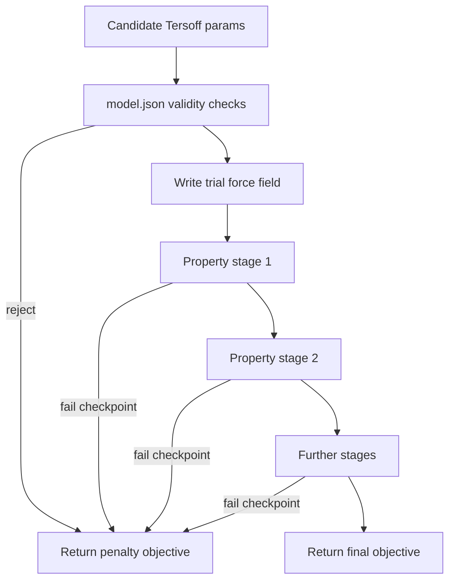

# General framework for Tersoff force field fitting using BLAST

This document describes how a **BLAST** (interatomic potential fitting) run directory is organized when fitting a **Tersoff** potential. It is material-agnostic: the same layout applies whether you fit one element pair today and another tomorrow.

This is a **framework document**, not the main project constitution. It lives under `constitution/` alongside other governance and architecture docs that may be added later (for example, a genetic-algorithm search layer).

---

## 1. Purpose

A BLAST run directory is a self-contained workspace for **force-field fitting**:

1. A **search driver** proposes candidate Tersoff parameters.
2. An **objective function** writes a trial force field, runs **LAMMPS** property calculations, and scores predictions against a **reference structure catalog** (typically DFT-derived targets).
3. Results are logged to a hierarchical report. The search uses scores to propose better candidates.

The goal is a Tersoff potential that reproduces target properties cheaply in MD, without repeating expensive electronic-structure calculations.

---

## 2. Scope

**In scope**

- Run-directory layout and file roles
- Tersoff `model.json` contract
- Objective pipeline (property ladder, early exit)
- Search-layer plug-in interface (MCTS today; GA or other methods later)
- Reporting, restarts, and HPC execution conventions

**Out of scope**

- Specific materials, element pairs, or training-set names
- Hardcoded structure filenames or CFS project paths
- Fixed numeric checkpoint thresholds (those belong in objective config)
- Implementation of a genetic algorithm (future document)

---

## 3. Run directory contract

Each fitting run is a directory `${RUN_DIR}` (often named `${RUN_NAME}` under a project root such as an AgenticBLAST tree). Standard artifacts:

| Artifact | Role |
|---|---|
| `settings.json` | Training catalog root, LAMMPS executable, tmp dir, report dir, workflow flags |
| `model.json` | Tersoff parameter schema: names, bounds, formats, validity constraints |
| `main*.py` | **Objective function**: load params → write trial FF → score properties → return scalar |
| `changemodel.json.py` | Narrow parameter bounds around a single candidate (local search window) |
| `startmodel.py` | Rebuild bounds from best trials in the report; update restart seed |
| `${SEARCH_DRIVER}.py` | Search loop (e.g. MCTS via `RunBOP.py`); calls objective, never LAMMPS directly |
| `reports/ho.report` | Trial log: inputs, stage scores, `finalObj`, failure reasons |
| `mcts_restart.*` | Best-known parameter vector for search restart |
| `*.restart` | Persistent search state (tree, population, etc.) |
| `blast.log` | Runtime trace: LAMMPS invocations, tmp paths, errors |
| `tmp/` | Ephemeral LAMMPS working directory (often RAM-backed on compute nodes) |
| `run.sh`, `*.sh` | One-shot evaluation of a fixed parameter vector (no search loop) |

Optional outputs after successful property stages: phonon files, DOS, plots, `current.data`, analytics.

---

## 4. Configuration

### 4.1 `settings.json`

Minimal contract:

```json
{
  "model": "model.json",
  "data": {
    "path": "${TRAINING_DATA_ROOT}",
    "earlyexit": true,
    "reports_dir": "reports"
  },
  "lmp": {
    "cmd": "${exe}",
    "nprocess": 1,
    "exe": "${LAMMPS_EXE}",
    "tmp_dir": "tmp"
  }
}
```

- **`data.path`** — root of the reference structure catalog. Never hardcode this in shared framework code.
- **`data.earlyexit`** — if true, return penalty objective as soon as a stage checkpoint fails.
- **`lmp.exe`** — LAMMPS binary used for all predictions.

### 4.2 Training catalog contract

The catalog lives at `${TRAINING_DATA_ROOT}`. BLAST treats it as a set of **entries** (e.g. LAMMPS `.data` files), not as fixed names like `1.data` or `2.data`.

Each entry should carry metadata indicating which properties are valid targets (lattice, cohesive energy, EOS, phonon, elastic, etc.).

The objective selects which catalog entries participate in each property stage via **configuration or metadata**, not hardcoded filenames or indices. Different materials may use different numbers of polymorphs or structures.

---

## 5. Tersoff model contract (`model.json`)

The model file defines the potential type and searchable space. Example pattern:

```json
{
  "model": {
    "tersoff (metal) | parameters | ${ELEMENT_PAIR}": {
      "1. _ _r0 (Å) ∈ (0.0, inf)": "[lower, upper]  %.6f",
      "…": "…",
      "? _r1 <= _r0": "reject",
      "? A < B": "reject"
    }
  }
}
```

**Fixed parameters** — indices, cutoffs marked as constants, or parameters outside the search range.

**Searchable parameters** — numeric bounds in `[lower, upper]` with a format string. Typical Tersoff metal set includes cutoffs, well depths, and angular terms (exact count depends on the interaction set).

**Validity constraints** — lines prefixed with `?` reject invalid combinations *before* LAMMPS runs (e.g. ordering of cutoffs, sign rules).

**`${ELEMENT_PAIR}`** — the interaction label in the model header (e.g. `X-X`). Replace per material; do not bake into shared code.

Bounds may be tightened between search rounds by `changemodel.json.py` (local ±fraction window) or `startmodel.py` (statistics from top trials in `ho.report`).

---

## 6. Objective pipeline (property ladder)

The objective in `main*.py` implements a **staged evaluation**. Order and enabled stages are defined in the objective script or config for that run.



### Per-stage pattern

For each property stage and each selected catalog entry:

1. **Compute target** — load reference value from catalog (`*_t` suffix).
2. **Compute prediction** — run LAMMPS with trial force field (`*_p` suffix).
3. **Score** — aggregate error metrics into a stage objective.
4. **Checkpoint** — if conditions fail and `earlyexit` is true, return penalty immediately.

### Typical property stages

These are common in Tersoff BLAST workflows; enable and order them per material:

| Stage | What it checks |
|---|---|
| Lattice | Unit cell lengths and angles vs reference |
| Cohesive energy (ce) | Absolute energies and relative ordering across polymorphs |
| Equation of state (eos) | Energy–volume curve shape and shift |
| Phonon | Dispersion, acoustic/optical branches, stability metrics |
| Elastic | Elastic tensor components vs reference |

Checkpoint **conditions** (maximum allowed error, ordering rules, shape limits) are **run-specific**. They belong in the objective configuration, not in this framework document.

### Penalty objective

Failed validity checks or failed checkpoints return a large **penalty score** (`${PENALTY_SCORE}`). In typical BLAST runs this is on the order of `1e6`. A score near the penalty value means the trial failed a stage — it is normal search signal, not necessarily a bug.

Completing all enabled stages returns a **final objective** from the hierarchical objective (HO) system, logged as `finalObj` in `ho.report`.

### Runtime setup

The objective usually:

- Creates a RAM-backed tmp dir under `/dev/shm` and symlinks it to `tmp/` for fast LAMMPS I/O.
- Resets the working subdirectory per trial under `tmp/${WORKER_NAME}/`.
- Appends structured lines to `reports/ho.report` for every trial.

---

## 7. Search layer interface

The search driver is **pluggable**. Current deployments often use Monte Carlo tree search (`RunBOP.py` + `MCTree`). A genetic algorithm or other optimizer should use the same contract.

### Inputs

- Parameter vector within `model.json` bounds (length = number of searchable parameters).
- Optional restart seed from `mcts_restart.*` or equivalent.

### Outputs

- Scalar objective (minimize).
- Side effect: append trial to `ho.report`.

### Side effects (optional)

- Save search state to `*.restart`.
- Update restart seed with best-known parameters.
- Narrow bounds via `changemodel.json.py` or `startmodel.py`.

### Rules for new search methods (e.g. GA)

- **Do not** embed LAMMPS or property logic in the search driver.
- **Do** call the same objective function (or a thin wrapper) for every candidate.
- **Do** treat penalty scores as valid fitness values.
- **Do** persist population / generation state in restart files analogous to `mctree.restart`.

---

## 8. Reporting and analysis

### `ho.report`

The hierarchical objective report is the canonical trial log. Each trial typically includes:

- An `input` line with the parameter vector.
- Stage and substage score lines.
- A `# … | finalObj | …` line with the scalar result and optional failure reason (property name, checkpoint that failed).

Parse this file generically — do not assume a fixed number of trials or a converged fit.

### Analysis tools

Repo utilities such as `scripts/analysis_ho_report.py` and `scripts/analysis.ipynb` plot **score vs iteration** by parsing `finalObj` lines. They work on any run directory that follows this report format.

### Interpreting results

- Many penalty scores early in search are expected.
- Best trial = minimum `finalObj` among scored trials.
- If best score is still near `${PENALTY_SCORE}`, no candidate has passed all enabled stages yet.
- Stage-failure counts (lattice vs ce vs phonon, etc.) diagnose which properties are hardest for the current material.

---

## 9. HPC execution

Follow NERSC Perlmutter conventions (see `.cursor/rules/perlmutter-blast.mdc`):

| Location | Allowed work |
|---|---|
| Login node | Edit code, git, small sanity checks, `sbatch` |
| Compute node | LAMMPS runs, objective evaluation, search loops |

- Keep run directories and configs under `$HOME` or `$SCRATCH` / CFS as appropriate.
- Put large training catalogs and heavy outputs on scratch or project CFS — not `$HOME`.
- Submit long searches via Slurm; do not run large LAMMPS campaigns on login nodes.
- After a job ends, `tmp/` may be a **dead symlink** to a removed `/dev/shm` path. That is expected.

---

## 10. Placeholder glossary

| Placeholder | Meaning |
|---|---|
| `${RUN_DIR}` | Root of one fitting run |
| `${RUN_NAME}` | Short label for the run (directory name) |
| `${TRAINING_DATA_ROOT}` | Reference structure catalog path (`settings.json` → `data.path`) |
| `${ELEMENT_PAIR}` | Tersoff interaction label in `model.json` |
| `${LAMMPS_EXE}` | LAMMPS binary (`settings.json` → `lmp.exe`) |
| `${SEARCH_DRIVER}` | Search implementation (MCTS, GA, etc.) |
| `${PENALTY_SCORE}` | Objective returned on validity or checkpoint failure |
| `${WORKER_NAME}` | Per-process tmp subdirectory label (often date-based) |

---

## 11. Agent and developer behavior

When working on or extending this framework:

1. Read `settings.json` and `model.json` before diagnosing a run.
2. Never hardcode material names, element pairs, structure filenames, or CFS project IDs into shared framework code — use placeholders and config.
3. Treat penalty objectives as normal search output until a trial completes all stages.
4. When adding a new search method, swap only `${SEARCH_DRIVER}`; keep the objective and LAMMPS pipeline unchanged.
5. Put material-specific checkpoint thresholds in the objective config for that run, not in this document.
6. Prefer restarting from `mcts_restart.*` and `*.restart` over discarding prior search progress.

---

## 12. Relationship to other documents

| Document | Role |
|---|---|
| This file | General BLAST + Tersoff run-directory framework |
| Future: genetic-algorithm architecture | Population, crossover, mutation, selection on top of this objective |
| Future: main constitution | Top-level project governance |
| `.cursor/rules/perlmutter-blast.mdc` | HPC and agent conventions for Perlmutter |

---

## Summary

A BLAST Tersoff fitting run is a **search loop wrapped around a property ladder**. The run directory holds config, the objective, the search driver, reports, and restarts. Materials differ only in `${TRAINING_DATA_ROOT}`, `${ELEMENT_PAIR}`, bounds, enabled stages, and checkpoint thresholds — not in the overall architecture described here.
