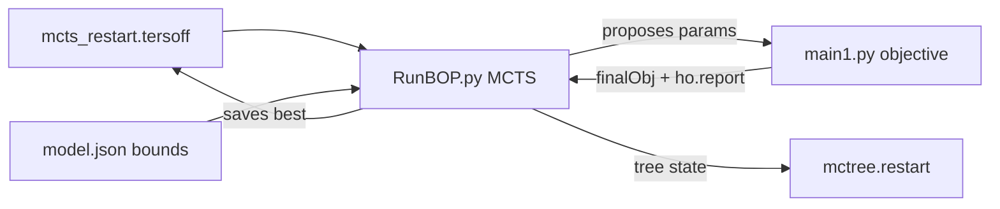

# Force Field Fitting — General

Quick recollection notes for **BLAST Tersoff force-field fitting**. For full detail see [`constitution/General framework for Tersoff force field fitting using BLAST.md`](../constitution/General%20framework%20for%20Tersoff%20force%20field%20fitting%20using%20BLAST.md). For run comparison and next steps see [`strategy/strategy.md`](../strategy/strategy.md).

---

## What a run directory is

One folder = one fitting experiment. BLAST proposes Tersoff parameters, LAMMPS predicts properties, scores are compared to a reference catalog (DFT targets). A search driver (e.g. MCTS in `RunBOP.py`) loops until you get a good potential or stop the job.

---

## Files to know

| File | Role |
|---|---|
| `settings.json` | Training data path, LAMMPS exe, tmp dir, report dir |
| `model.json` | Tersoff parameter bounds and validity rules |
| `main1.py` | **Objective** — property ladder, returns score |
| `RunBOP.py` | **Search** (MCTS) — calls objective, does not run LAMMPS itself |
| `reports/ho.report` | Trial log — main result to analyze |
| `mcts_restart.*` | Seed parameters for restart |
| `changemodel.json.py` | Narrow bounds around one candidate |
| `startmodel.py` | Rebuild bounds from best trials in `ho.report` |
| `run.sh` | Evaluate one fixed parameter set (no search) |

---

## How `RunBOP.py`, `main1.py`, and `mcts_restart.tersoff` connect



- **`RunBOP.py`** — search driver (MCTS). Builds a parameter tree, picks nodes to expand, and **calls `main1.objective(params)`** for each candidate. Does not run LAMMPS itself.
- **`main1.py`** — evaluator. Given a parameter vector: validate → write trial FF → run property ladder (LAMMPS) → return scalar score; append trial to `reports/ho.report`.
- **`mcts_restart.tersoff`** — **restart seed**: one line with the best-known Tersoff parameters. On restart, `RunBOP.py` reads this as `startset` instead of random params. Updated when a better trial is found (also via `startmodel.py` from `ho.report` stats).
- **`mctree.restart`** — MCTS **tree state** (separate from the parameter seed); resume search without rebuilding the tree.

One-shot eval bypasses MCTS: `run.sh` calls `main1.py` directly with fixed params from the command line.

---

## Property ladder (`main1.py`)

Stages run in order with **early exit** on failure (if `earlyexit: true` in settings):

1. Lattice  
2. Cohesive energy (+ polymorph **ordering** if multiple structures)  
3. Equation of state  
4. Phonon  
5. Elastic  

Failed stage → large **penalty score** (~1e6). Lower `finalObj` is better. Penalty ≈ normal early in search, not necessarily a bug.

---

## Polymorph strategies (one line in `main1.py`)

Controls which catalog structures enter each stage:

| Strategy | Selection | Effect |
|---|---|---|
| Single polymorph | `[0]` only | Easier search; reaches phonon/elastic more often |
| Two polymorphs | `[0, 1]` | Stricter; lattice + ce ordering for both; many trials fail early |
| **Hybrid** | `[0]` for lattice/eos/phonon/elastic; `[0,1]` for **ce only** | Balance: explore like single, enforce ordering like dual |

Example hybrid pattern:

```python
polymorphs_single = list(all_polymorphs[i] for i in [0])
polymorphs_ce = list(all_polymorphs[i] for i in [0, 1])
```

---

## Reading `ho.report`

- `input` line = trial parameter vector  
- `# … | finalObj | …` = final score + reason (which stage failed)  
- Best trial = minimum `finalObj`  
- Each property block in stage lines has `return {...}` metrics (e.g. eos `shape.obj`/`shift.obj`; phonon `ceil.maxAE%`/`ceil.MAE%`) and `checkpoint` pass/fail rules — parsed by `blast_lib/trial_details.py` for dashboard/Agent Chat  
- Each trial's **`input` line** in ho.report carries the Tersoff parameter vector (e.g. `Sb-Sb: r0 r1 E1 ...`) — included in Agent Chat context  
- Dashboard **Agent Chat** is agentic: Gemini calls `blast_lib/agent_tools.py` to read ho.report and main1.py on demand (not a static context blob)
- Parse/plot: `scripts/analysis_ho_report.py` or `scripts/analysis.ipynb`
- **Most trials fail (penalty ~1e6) — expected.** Only analyze the **top few** lowest scores and `mcts_restart.tersoff`; see [`strategy/strategy.md`](../strategy/strategy.md).

---

## HPC (Perlmutter)

- **Login node**: edit, submit Slurm — not heavy LAMMPS  
- **Compute node**: objective + LAMMPS via batch/interactive job  
- Run dirs often on CFS; training data on project storage; `tmp` may symlink to `/dev/shm` (gone after job)

---

## Practical workflow

1. Set `settings.json` (data path, LAMMPS)  
2. Set `model.json` (bounds for your element pair)  
3. Choose polymorph strategy in `main1.py`  
4. Run search (`RunBOP.py`) or one-shot (`run.sh` / `main1.py` with args)  
   - **AgenticBLAST batch:** write `input.txt` (run dir paths) at project root → interactive `salloc` → `cat input.txt \| parallel "… RunBOP.py"` on the compute node (see `docs/agenticblast-submit.md`)  
   - **Dashboard Create Run Folder:** rsync **template** folder → patch `main1.py` (lattice/ce maxAE%; eos `shape.obj`/`shift.obj`; phonon `ceil.maxAE%`; elastic MAE%), seed restart from optional **source** folder (see `docs/run-folder-setup.md`)  
5. Analyze `reports/ho.report`  
6. Optional: `startmodel.py` / `changemodel.json.py` to tighten bounds; restart from `mcts_restart.*`

---

## Keep material-agnostic

Use config placeholders (`${TRAINING_DATA_ROOT}`, `${ELEMENT_PAIR}`) — do not hardcode structure names, element names, or CFS project IDs in shared framework code.
